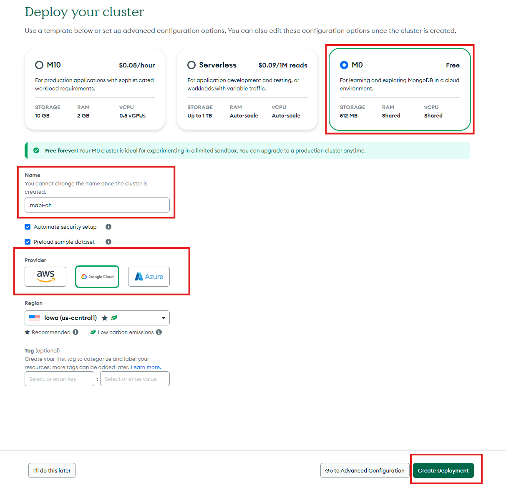
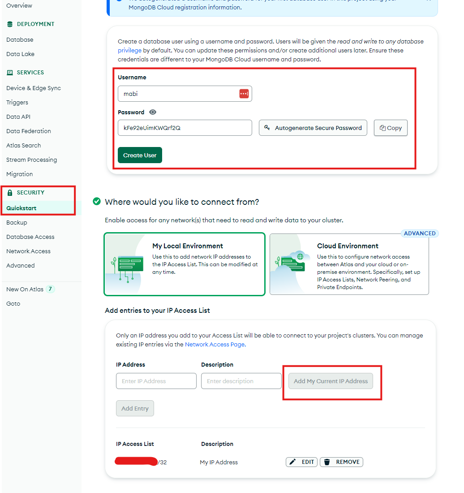
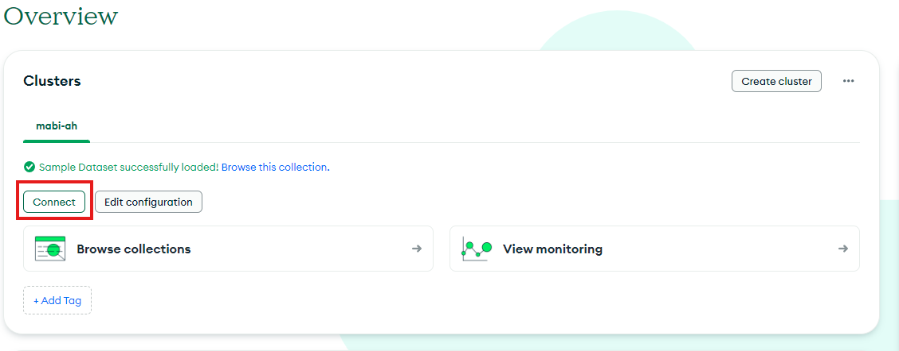
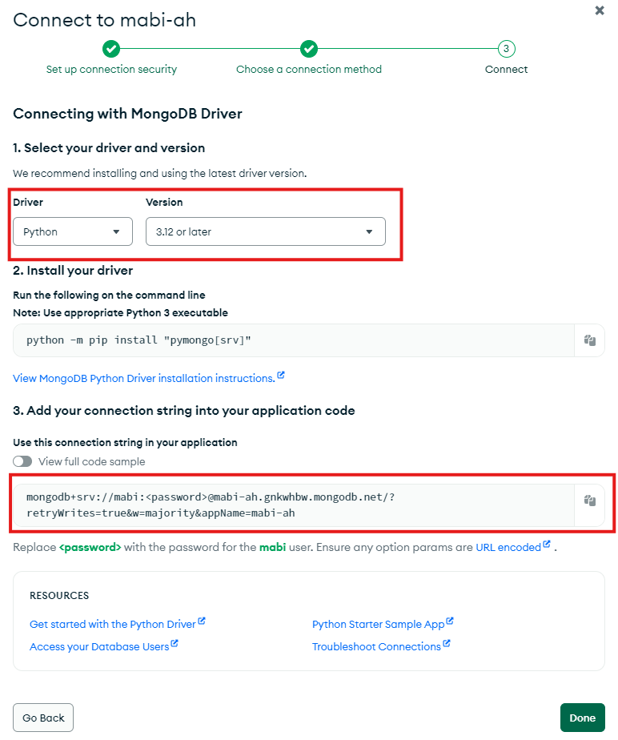

# mabi-ah-discord
Mabinogi Auction House Watcher using Discord Bot + MongoDB Atlas 

This Discord Bot query items from [MabiBase](https://na.mabibase.com/) and alert to the Discord channel if new item was added that matches the alert criteria. This has the same function as MabiBase built-in alert bot. However, MabiBase bot has a 5 minutes alert interval and send alerts to everyone who subscribes to its alerting function. Thus, the popular items are hotly contested and very difficult to buy at a good price.

This bot alert faster than the MabiBase built-in alerting function as this will constantly watching the database and checking items from the alert list. This will give an advantage edge in the game when buying items at a good price.

https://github.com/user-attachments/assets/358889d6-3a1b-47ae-baa8-946c385c0714

# How to use

## Creating and Inviting a Private Discord Bot

1. Navigate to https://discord.com/developers/applications to create a new bot
2. Click on `New Application` on top right
3. Enter name for your Discord bot, accept ToS and click `Create`
4. Go to `OAuth2` tab on the left and perform the following:
  - Under `Client Information`:
    - Click on `Reset Secret`
  - Under `OAuth2 URL Generator`:
    - Check `Bot`
  - Under `Bot Permissions`:
    - Check `Administrator` 
  - Under `Integration Type`:
    - Select `Guild Install`
5. This will generate an invite link. Copy this and paste to your browser. Select the server you want to add this bot to and click `Continue` and then `Authorize`
6. Go back to the Developer Portal. Go to `Installation` on the left and select `None` in the dropdown under `Install Link`
7. Go to `Bot` tab on the left and perform the following:
  - Under `Authorization Flow`:
    - Disable `Public Bot`
    - Enable `Requires OAUTH2 Code Grant`
  - Under `Priviledged Gateway Intents`:
    - Enable `Presence Intent`
    - Enable `Server Members Intent`
    - Enable `Message Content Intent`
  - Under `Bot Permissions`:
    - Check `Administrator` 
8. Generate a `Token` by going to `Bot` tab and click on `Reset Token` under `Token`. Save this token to use for the app.

## Creating a free MongoDB Atlas instance

1. Sign up an account for a free shared resource pool MongoDB Atlas database: https://www.mongodb.com/cloud/atlas/register
2. Once you've created an account and login to https://cloud.mongodb.com/, click on `Create` button under `Create a cluster`
3. Select the `M0` free cluster, name the cluster and pick your favorite provider. Then click `Create Deployment`

   

4. Click on `Quick Start` under `Security` on the left hand bars
5. Create an `username` and `password` for your database. Then scroll down and click on `Add My Current IP Address` to the IP Address List. You can add `0.0.0.0/0` if you want to expose the database to everyone or if your ISP IP is not static.

    

6. On the Clusters menu, click on `Connect` on your new cluster

    

7. Select `Drivers` under `Connect to your application`
6. On the next page, select `Python` under Driver and use the latest Stable API
8. Save the connection string to use for the app. Modify it with the password as instructed.

    


## Usage - Local

1. Clone this repo

```
git clone https://github.com/dqle/mabi-ah-discord.git
```

2. Create a `.env` file containing the following:
```
DISCORD_API_TOKEN         = ""
DISCORD_SERVER_ID         = ""
DISCORD_CHANNEL_ID        = ""
MONGODB_CONNECTION_STRING = ""
```
 - `DISCORD_API_TOKEN` is generated from step 8 of `Creating and Inviting a Private Discord Bot` Section
 - `DISCORD_SERVER_ID` can be found by right click your server where you add the bot and click `Copy Server ID`
 - `DISCORD_CHANNEL_ID` is the channel where you want the alert to go to. This can be found by right click your channel and click `Copy Channel ID`
 - `MONGODB_CONNECTION_STRING` is generated from step 8 of `Creating a free MongoDB Atlas instance` Section

 3. Install requirements and run the program:
 ```
  pip install -r .\requirements.txt
  python.exe .\main.py #Windows
 ```

## Usage - Docker Compose

1. Copy the `docker-compose.yaml` file

2. In the same directory as the `docker-compose.yaml`. Create a `.env` file containing the following:
```
DISCORD_API_TOKEN         = ""
DISCORD_SERVER_ID         = ""
DISCORD_CHANNEL_ID        = ""
MONGODB_CONNECTION_STRING = ""
```
 - `DISCORD_API_TOKEN` is generated from step 8 of `Creating and Inviting a Private Discord Bot` Section
 - `DISCORD_SERVER_ID` can be found by right click your server where you add the bot and click `Copy Server ID`
 - `DISCORD_CHANNEL_ID` is the channel where you want the alert to go to. This can be found by right click your channel and click `Copy Channel ID`
 - `MONGODB_CONNECTION_STRING` is generated from step 8 of `Creating a free MongoDB Atlas instance` Section

3. Run docker compose:

```
docker compose up -d
```

## Usage - Helm Chart